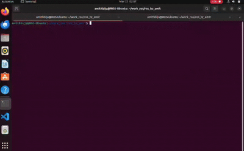

# Horizon Software Tasks 2026

This repository contains solutions and documentation for all levels, including the bonus ROS2 task.

## Documentation Links

- Level 1 (Rover Distance): [level-1_rover_distance/Documentation.md](level-1_rover_distance/Documentation.md)
- Level 2 (Arduino Servo): [level-2_arduino_servo/Documentation.md](level-2_arduino_servo/Documentation.md)
- Level 3 (ROS2): [level-3_ros_ws/Documentation.md](level-3_ros_ws/Documentation.md)
- Bonus Task (ROS2 Command Node): [bonus_ros_ws/Documentation.md](bonus_ros_ws/Documentation.md)

## Task Summary

### Level 1 - Rover Distance
- C++ console app for distance and travel-time calculation.
- Includes input validation and output image.

Output screenshot:


### Level 2 - Arduino Servo Limit
- Potentiometer controls servo angle.
- Safety logic limits angle to `68` degrees.
- LED turns `ON` when requested angle crosses safe limit.

Output proof:


### Level 3 - ROS2 Publisher/Subscriber
- ROS2 Humble package
- Distance Publisher Node
- Distance Subscriber Node
- Topic communication on `/distance`




### Bonus Task - ROS2 Rover Command Node
- Decision node subscribes to `/distance`
- Publishes movement commands to `/rover_command`
- Optional command listener prints rover command actions

Detailed diagram:
```text
Sensor Node
  |
  | publishes /distance
  v
Decision Node
  |
  | publishes /rover_command
  v
Command Listener Node
```


