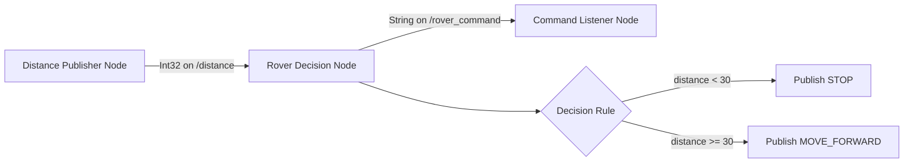
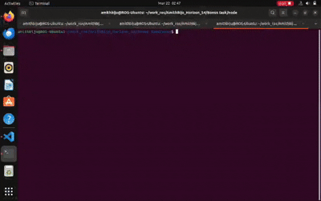

# Bonus Task - ROS2 Rover Command Node Documentation

## Goal

Extend the Level 3 ROS2 project so rover movement commands are published after distance-based decisions.

## Architecture

```text
Sensor Node -> publishes /distance
Decision Node -> subscribes /distance, publishes /rover_command
Command Listener Node -> subscribes /rover_command
```

## Concept Diagram 



## Package Structure

```text
bonus_ros_ws/
  src/
    distance_sensor_bonus/
      package.xml
      setup.py
      setup.cfg
      resource/distance_sensor_bonus
      distance_sensor_bonus/
        __init__.py
        distance_publisher.py
        rover_decision_node.py
        command_listener.py
```

## Node Responsibilities

### 1) Distance Publisher
- Publishes random distance values on `/distance`
- Message type: `std_msgs/msg/Int32`

### 2) Rover Decision Node
- Subscribes to `/distance`
- Rule:
- `distance < 30` -> `STOP`
- `distance >= 30` -> `MOVE_FORWARD`
- Publishes command on `/rover_command`
- Message type: `std_msgs/msg/String`

### 3) Command Listener Node (Optional)
- Subscribes to `/rover_command`
- Prints received command and rover action text

## Build and Run

Terminal 1:

```bash
source install/setup.bash
ros2 run distance_sensor_bonus distance_publisher
```

Terminal 2:

```bash
source install/setup.bash
ros2 run distance_sensor_bonus rover_decision_node
```

Terminal 3 :

```bash
source install/setup.bash
ros2 run distance_sensor_bonus command_listener
```

## Example Output

```text
Distance received: 22
Command published: STOP

Distance received: 55
Command published: MOVE_FORWARD

Received command: MOVE_FORWARD
Rover wheels moving...
```

## Output Proof


