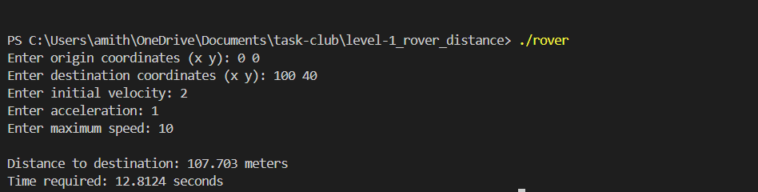

# Rover Distance and Travel Time Calculator

This module implements a small C++ console program that:

1. Reads rover start and destination coordinates.
2. Computes straight-line distance between the two points.
3. Estimates travel time using basic kinematics.

## What the Program Does

The executable prompts for:

- Origin coordinates: `(x1, y1)`
- Destination coordinates: `(x2, y2)`
- Initial velocity `v`
- Acceleration `a`
- Maximum speed `maxSpeed`

Then it prints:

- Distance to destination (meters)
- Time required (seconds)

## Project Structure

```text
level-1_rover_distance/
  include/
    Rover.hpp          # Class declaration
  src/
    Rover.cpp          # Distance/time implementations
    main.cpp           # Input, validation, output flow
  output_img/
    out-1.png         # Sample output image
```

## Core Logic

### 1) Distance Calculation

Implemented in `Rover::calculateDistance(...)`:

```text
distance = sqrt((x2 - x1)^2 + (y2 - y1)^2)
```

This is Euclidean distance in 2D.

### 2) Time Calculation

Implemented in `Rover::calculateTime(...)`:

- If `a == 0`, constant-speed motion is used:

```text
t = s / u
```

- Otherwise, it solves from:

```text
s = u*t + (1/2)*a*t^2
t = (-u + sqrt(u^2 + 2*a*s)) / a
```

where:

- `s` = distance (meters)
- `u` = initial velocity (m/s)
- `a` = acceleration (m/s^2)
- `t` = time (seconds)

## Input Validation Present in `main.cpp`

The program rejects:

- Invalid coordinate parsing
- Negative velocity (`v < 0`)
- Negative acceleration (`a < 0`)
- Non-positive maximum speed (`maxSpeed <= 0`)
- `v == 0` and `a == 0` (rover cannot move)
- `v > maxSpeed`

## Build Instructions

From `level-1_rover_distance`:

```bash
g++ -std=c++17 src/main.cpp src/Rover.cpp -Iinclude -o rover

.\rover
```

## Example Run

Input:

```text
Enter origin coordinates (x y): 0 0
Enter destination coordinates (x y): 3 4
Enter initial velocity: 0
Enter acceleration: 1
Enter maximum speed: 10
```

Output:

```text
Distance to destination: 5 meters
Time required: 3.16228 seconds
```

## Output Image


