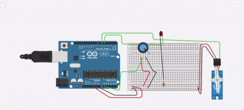
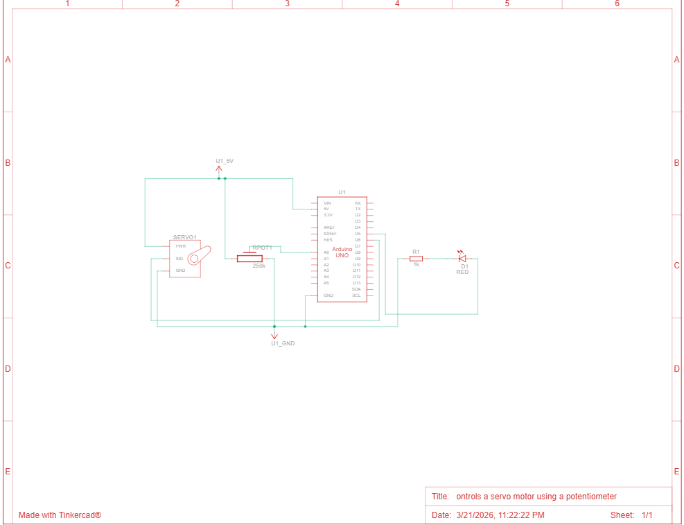
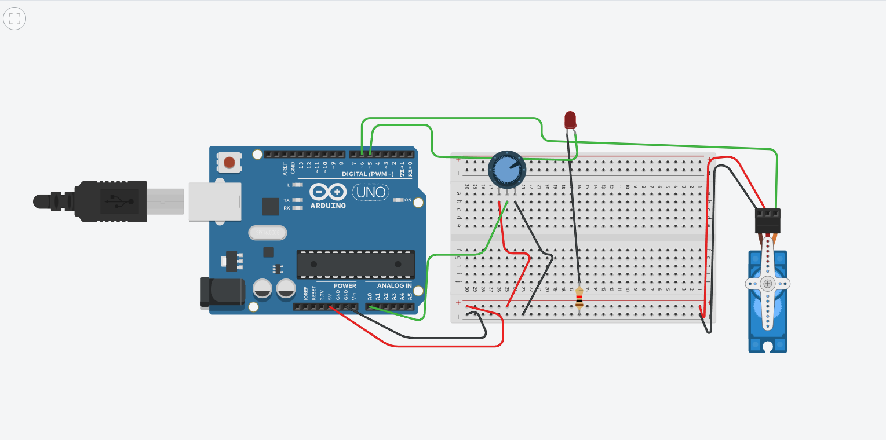

# Arduino Servo Control Documentation

## Overview

This Arduino sketch reads a potentiometer value, converts it to a servo angle, and limits the servo rotation to a safe maximum angle.

It also uses an LED as a limit indicator:

- LED `OFF`: servo is moving normally (0 to 68 degrees).
- LED `ON`: input requested an angle above 68 degrees, so output is clamped at 68 degrees.

## Source File

- `code/servo_logic.ino`

## Components Used

- Arduino board (Uno)
- Servo motor
- Potentiometer
- LED
- Resistor for LED (220 ohm)
- Jumper wires

## Pin Mapping 

- Potentiometer input: `A0`
- Servo signal pin: `D6`
- LED pin: `D5`

## Program Flow

1. Read analog value from potentiometer (`0` to `1023`).
2. Map analog value to angle (`0` to `180`).
3. If mapped angle is greater than `68`:
4. Set servo to `68` and turn LED `ON`.
5. Else:
6. Set servo to mapped angle and keep LED `OFF`.
7. Repeat every `20 ms`.

## Logic 

```text
raw_value = analogRead(A0)
angle = map(raw_value, 0, 1023, 0, 180)

if angle > 68:
    servo_angle = 68
    LED = ON
else:
    servo_angle = angle
    LED = OFF
```
## Output proof
 All proof of ouput is saved in output folder.

### Demo Video 


### Circuit Diagram


### Circuit Image

link -> https://www.tinkercad.com/things/gat3sHwqw1j-ontrols-a-servo-motor-using-a-potentiometer/editel?returnTo=https%3A%2F%2Fwww.tinkercad.com%2Fdashboard&sharecode=OQwKQmpdLX1BVEE4ix_cXQMMPB47l12ypWzKdd-FYZ0


