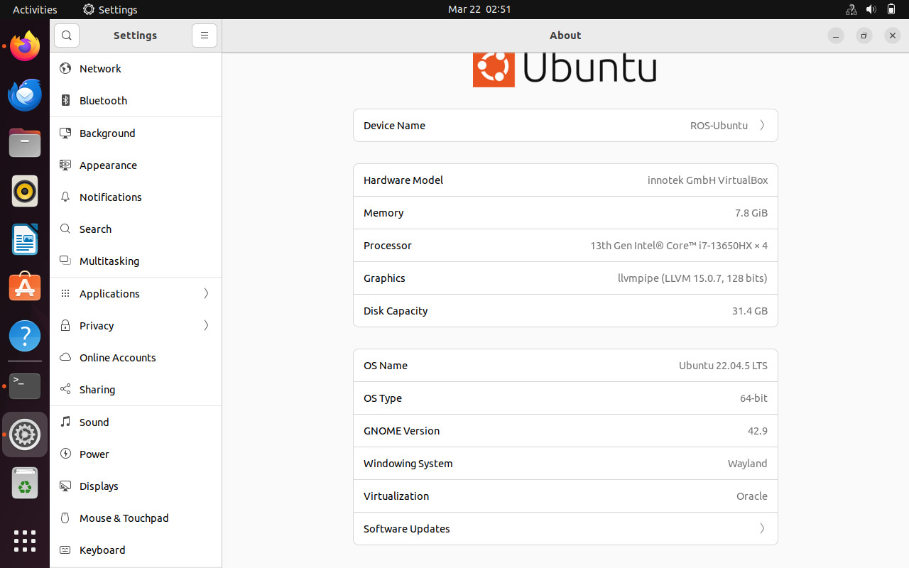
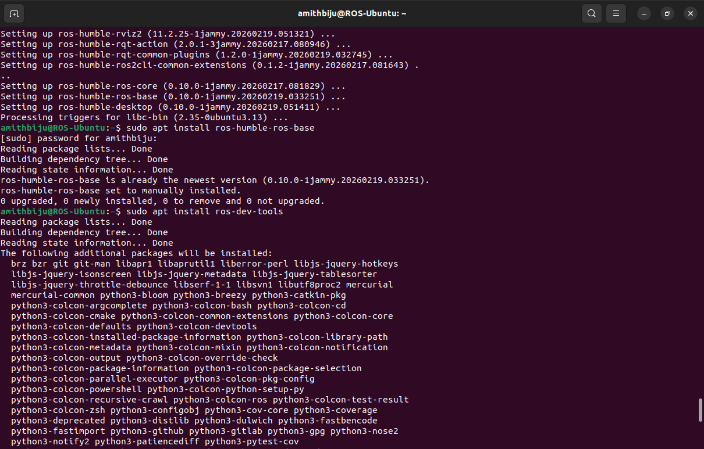

# Level 3 - ROS2 Task Documentation


## Aim
- Build a ROS2 project with two communicating nodes.

Node 1 - Distance Publisher:
- Publishes random distance values every second.
- Example values: `10`, `35`, `72`

Node 2 - Distance Subscriber:
- Subscribes to `/distance`
- Prints received distance values in terminal

Example output:

```text
Received distance: 10
Received distance: 35
Received distance: 72
```

## Workspace File Structure

```text
level-3_ros_ws/
  src/
    distance_sensor/
      package.xml
      setup.py
      setup.cfg
      resource/distance_sensor
      distance_sensor/
        __init__.py
        distance_publisher.py
        distance_subscriber.py
  output_media/ #proof of output
```

## Code Mapping

- Publisher node file: `src/distance_sensor/distance_sensor/distance_publisher.py`
- Subscriber node file: `src/distance_sensor/distance_sensor/distance_subscriber.py`
- Publish interval: `1.0` second

## Build and Run

Terminal 1:

```bash
source install/setup.bash
ros2 run distance_sensor distance_publisher
```

Terminal 2:

```bash
source install/setup.bash
ros2 run distance_sensor distance_subscriber
```

## References

- ROS2 playlist: https://youtube.com/playlist?list=PLLSegLrePWgJudpPUof4-nVFHGkB62Izy&si=r4nGx87aijba1muV
- ROS2 documentation: https://docs.ros.org/en/humble/index.html

### Proof




